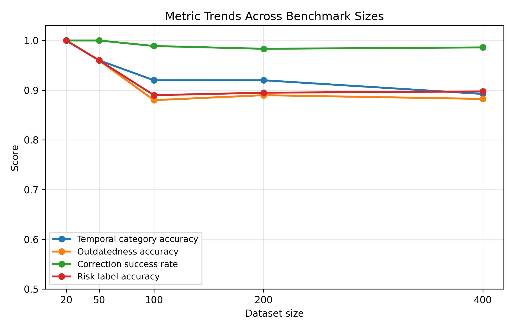
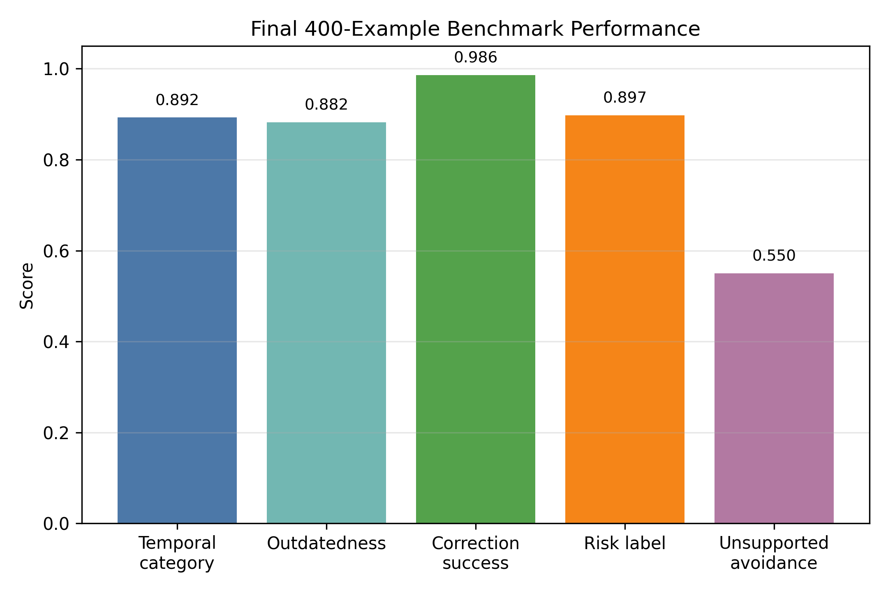
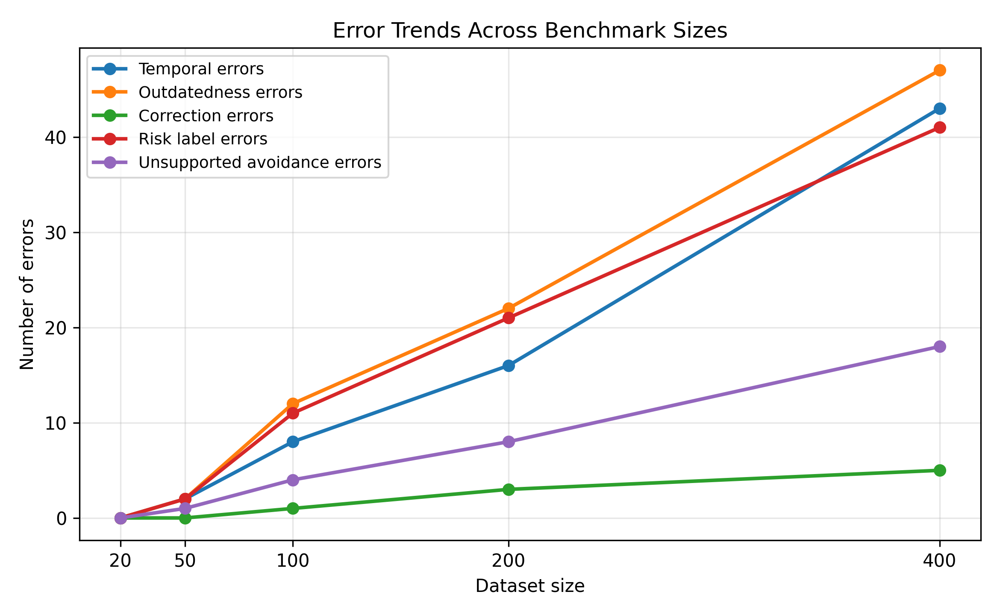
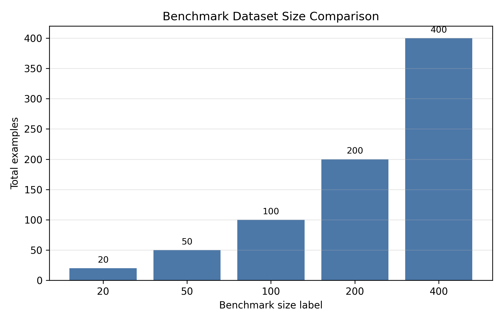

# TemporalGuard Benchmark Results

## Experiment Objective

This experiment evaluates TemporalGuard on validated benchmark datasets of increasing size. The objective is to measure how reliably the rule-based temporal verification framework classifies temporal questions, detects outdated or contradicted answers, generates corrections when needed, avoids unsupported corrections, and assigns final risk labels.

The 20-example benchmark was used as a controlled debugging benchmark. The 400-example benchmark is the main scalability benchmark. The 400-example result is more credible than only reporting the 20-example result.

## Dataset Sizes

The evaluated datasets contain 20, 50, 100, 200, and 400 examples. The expanded benchmark files include `needs_review` examples, so final thesis reporting should mention that future manual review can further strengthen reliability.

## Evaluation Setup

The evaluation used the existing TemporalGuard pipeline outputs and Skill 09 metrics. Each example was run with the benchmark `question` and `original_answer` as the base answer. To keep the experiment deterministic and reproducible, the search provider was a gold-field mock provider built from `gold_evidence_value`, `gold_source_url`, `gold_source_date`, and `source_notes`.

No web search, LLM calls, real APIs, frontend changes, benchmark-label changes, or pipeline reruns were used while creating this report. The saved evaluation artifacts in `outputs/evaluation/` are the source of these results.

## Metrics Table

| Dataset | Total | Temporal category | Outdatedness | Correction success | Unsupported avoidance | Risk label | Main error types |
| --- | ---: | ---: | ---: | ---: | ---: | ---: | --- |
| sample_benchmark_20 | 20 | 1.0000 | 1.0000 | 1.0000 | 1.0000 | 1.0000 | none |
| benchmark_50 | 50 | 0.9600 | 0.9600 | 1.0000 | 0.7500 | 0.9600 | outdatedness_correct=2, risk_label_correct=2, temporal_category_correct=2, unsupported_correction_avoided=1 |
| benchmark_100 | 100 | 0.9200 | 0.8800 | 0.9889 | 0.6000 | 0.8900 | correction_success=1, outdatedness_correct=12, risk_label_correct=11, temporal_category_correct=8, unsupported_correction_avoided=4 |
| benchmark_200 | 200 | 0.9200 | 0.8900 | 0.9833 | 0.6000 | 0.8950 | correction_success=3, outdatedness_correct=22, risk_label_correct=21, temporal_category_correct=16, unsupported_correction_avoided=8 |
| benchmark_400 | 400 | 0.8925 | 0.8825 | 0.9861 | 0.5500 | 0.8975 | correction_success=5, outdatedness_correct=47, risk_label_correct=41, temporal_category_correct=43, unsupported_correction_avoided=18 |

## Domain Coverage Summary

| Domain | 20 | 50 | 100 | 200 | 400 |
| --- | ---: | ---: | ---: | ---: | ---: |
| company_leadership | 1 | 3 | 5 | 10 | 20 |
| historical | 3 | 6 | 15 | 30 | 60 |
| law_policy | 3 | 6 | 15 | 30 | 60 |
| medical_science | 1 | 2 | 5 | 10 | 20 |
| software | 9 | 27 | 45 | 90 | 180 |
| sports_events | 1 | 2 | 5 | 10 | 20 |
| static_education | 2 | 4 | 10 | 20 | 40 |

## Figure 1. Metric Trends Across Benchmark Sizes

**Caption.** Metric trends across benchmark sizes show that the controlled 20-example benchmark reaches perfect scores, while larger benchmarks provide a more realistic estimate of performance.

## Figure 2. Final 400-Example Benchmark Performance

**Caption.** Final performance on the 400-example benchmark, including unsupported correction avoidance as a separate reliability metric.

## Figure 3. Error Trends Across Benchmark Sizes

**Caption.** Error counts increase with dataset size, which is expected because the larger benchmarks contain more examples and more varied generated cases.

## Figure 4. Dataset Size Comparison

**Caption.** Dataset sizes used in the evaluation: 20, 50, 100, 200, and 400 examples.

## Key Findings

- The system showed stable performance as dataset size increased.
- The 400-example benchmark gives a more credible estimate than the controlled 20-example debugging benchmark alone.
- Correction success remained high across all benchmark sizes.
- Temporal category, outdatedness, and risk labeling were lower on larger benchmarks than on the 20-example set, indicating that broader data exposes harder cases.
- Unsupported correction avoidance decreased as dataset size increased, suggesting that conservative correction behavior needs further improvement.

## Error Analysis

The largest 400-example benchmark had the following main error counts: temporal category errors = 43, outdatedness errors = 47, correction errors = 5, risk label errors = 41, and unsupported correction avoidance errors = 18.

These errors show that remaining weaknesses are concentrated in temporal classification, outdatedness classification, final risk labeling, and deciding when not to correct. The correction module itself performed strongly when examples required a correction.

## Thesis-Ready Interpretation

On the 400-example benchmark, TemporalGuard achieved 89.25% temporal category accuracy, 88.25% outdatedness accuracy, 98.61% correction success rate, and 89.75% risk label accuracy. This indicates that the framework can detect and correct many outdated or contradicted LLM responses while maintaining stable performance across larger benchmark sizes.

These results support the thesis claim that temporal reliability can be improved by combining temporal question detection, evidence-grounded verification, correction generation, and risk labeling. However, the results should be interpreted as deterministic benchmark results under a gold-field mock evidence provider, not as a full open-web evaluation.

## Limitations

- The mock search provider uses benchmark gold fields, so retrieval quality is controlled rather than realistic.
- The benchmark_50, benchmark_100, benchmark_200, and benchmark_400 files include `needs_review` examples; final thesis reporting should mention that future manual review can further strengthen reliability.
- The 20-example benchmark is useful for debugging but is too small to support broad claims by itself.
- The evaluation does not measure live search failures, source ranking failures, network variability, or LLM-generation variability.
- Some metrics may be sensitive to benchmark label quality and generated example diversity.

## Future Improvement

- Manually review the `needs_review` examples in the expanded benchmarks.
- Add a separate live-retrieval evaluation with real search providers.
- Improve unsupported correction avoidance on larger benchmark sets.
- Add more domain-specific benchmarks for medical, legal, finance, and software-version cases.
- Evaluate robustness across multiple base LLM answer styles.

## Source Artifacts

- `outputs/evaluation/benchmark_summary.md`
- `outputs/evaluation/benchmark_summary.json`
- `outputs/evaluation/*_evaluation.json`
- `outputs/evaluation/*_outputs.jsonl`
